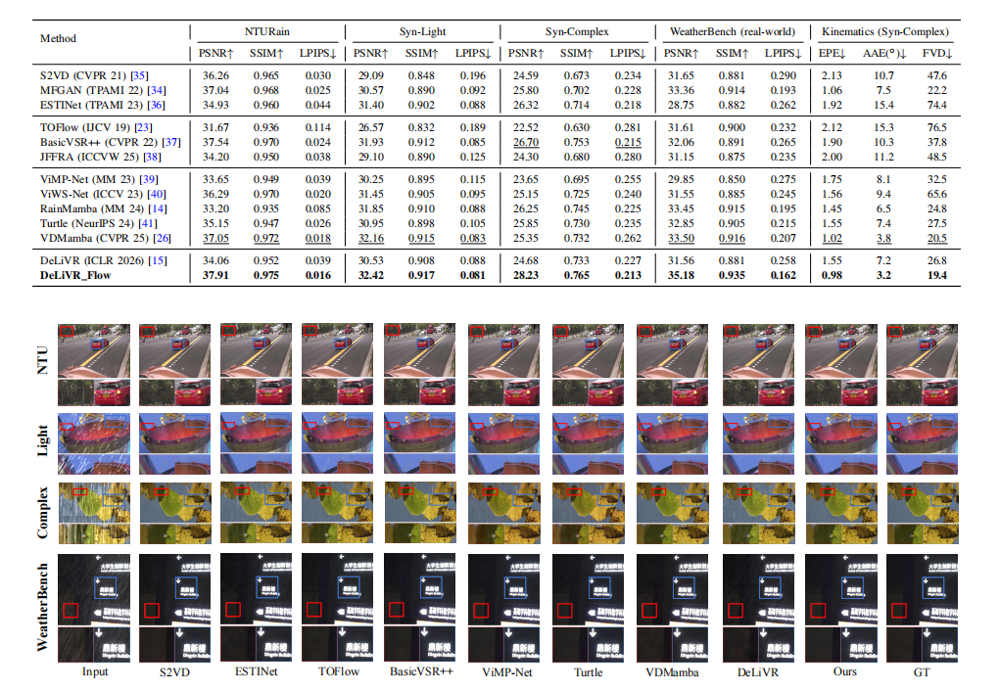
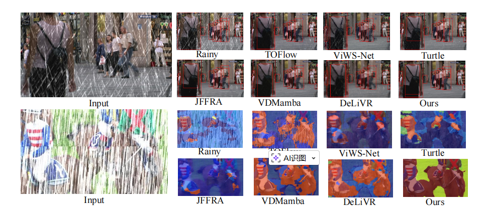
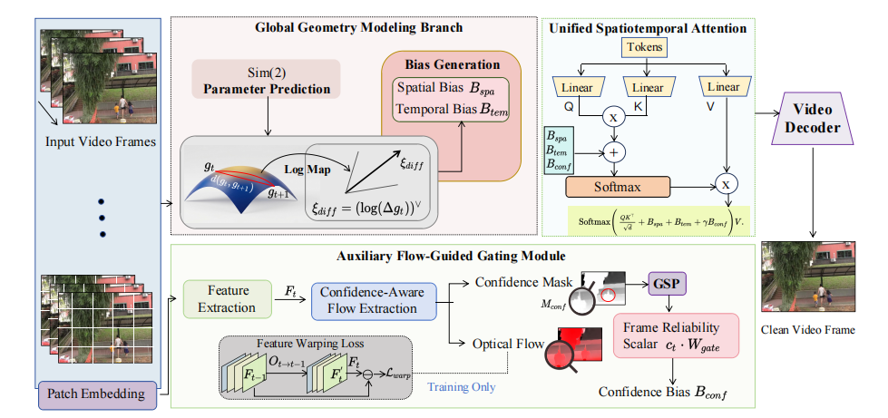

# 🏆 DeLiVR_Flow: Unified Sim(2) Lie-Group and Flow-Guided Attention for Video Deraining

[](#) [](#)[](https://opensource.org/licenses/MIT)
> Official PyTorch implementation of the paper **"DeLiVR_Flow: Unified $Sim(2)$ Lie-Group and Flow-Guided Attention for Video Deraining"**.
---
## Demo


https://github.com/user-attachments/assets/8cae93e5-f044-488d-80af-3f6798efba3b


## 📖 1. Introduction

Outdoor videos often suffer from severe rain streaks, and complex camera and object motion further cause serious inter-frame mismatches. Current approaches encounter a fundamental trade-off: implicit attention lacks the geometric rigor to model global kinematics, whereas explicit optical flow proves brittle under heavy rain interference.

**DeLiVR_Flow** addresses these challenges by proposing a unified spatiotemporal Transformer that seamlessly integrates global $Sim(2)$ geometric alignment with local motion-aware flow guidance.

**Our core mechanisms and contributions include:**
* **Global Geometric Prior (Sim(2) Lie-Group):** We upgrade the temporal alignment theory by extending the $SO(2)$ Lie-group to an Affine Lie-group. By computing continuous spatial inner-product biases and temporal differential group displacements, the network explicitly models rotation, translation, and scaling simultaneously. This guarantees robust background alignment under complex camera motions.
* **Local Kinematic Guidance (Flow-Guided Gating):** To simultaneously capture pixel-wise independent trajectories (e.g., moving pedestrians) that a global transformation cannot model, we propose an efficient flow integration mechanism. This lightweight module features a dual-level design: an implicit feature-level warping constraint during training and a global temporal gating mechanism during inference.
* **Adaptive Robustness under Extreme Weather:** Crucially, under extreme rain where optical flow estimations severely degrade, our confidence gating mechanism adaptively suppresses unreliable motion cues. This allows the network to safely rely on the stable $Sim(2)$ geometric prior to maintain structural integrity, completely preventing flow-corrupted artifacts.
---
## 🚀 2. Visual Results

### Video Deraining Performance
Our method effectively removes dense rain streaks and rain-induced color distortion while preserving fine structural details. 
 

### Improvements on Downstream Tasks
DeLiVR_Flow significantly enhances the reliability of downstream high-level vision systems (e.g., YOLOv8 for object detection and SegFormer for semantic segmentation) in rainy scenes.


---
## 🧠 3. Network Architecture

The framework contains a global geometry modeling branch and an auxiliary flow-guided gating module. The former predicts $Sim(2)$ transformation parameters to generate spatial and temporal biases for geometry-consistent alignment. The latter estimates confidence-aware optical flow and a confidence bias to suppress unreliable local motion cues. These biases are jointly injected into a unified spatiotemporal attention module.

---
## 🛠️ 4. Environment Installation

We use `Python=3.9.12`, and `PyTorch>=1.13.1` with `CUDA=11.7`.

Installation of required packages:
```bash
pip install -r requirements.txt
````
---
## 📂 5. Dataset

We used NTURain, Syn-Light, Syn-Complex, and WeatherBench to train and test our models.
Please organize your benchmark datasets following the standard structure below:
Plaintext

```
├── NTURain
│   ├── test
│   ├── test_real
│   └── train
├── RainSynComplex25
│   ├── test
│   └── train
├── RainSynLight25
│   ├── test
│   └── train
└── WeatherBench
    ├── test
    └── train
```
_Note: The `gt` folder is only required for standard metric evaluation. For wild inference on your own videos, only the input frames are needed._

---
## 🚂 6. Training

We provide scripts for both single-GPU fine-tuning and multi-GPU Distributed Data Parallel (DDP) training.
**Single-GPU Training** (e.g., 1x RTX 4090 48GB):
Note: Keep `batch_size=32` per GPU to prevent Out-of-Memory (OOM) errors._
Bash
```
CUDA_VISIBLE_DEVICES=0 python train_video5.py \
  --data_root /path/to/dataset/train \
  --val_root /path/to/dataset/test \
  --input_dirname input \
  --target_dirname target \
  --use_affine 1 \
  --enable_flow_bias 1 \
  --batch_size 32 \
  --lr 2e-4 \
  --resume ./yourdocument/last.pth \
  --epochs 2000 \
  --workers 8 \
  --save_dir ./yourdocument \
  --embed_dim 128 \
  --patch 8 \
  --heads 8
```
**Multi-GPU DDP Training** (e.g., 4x RTX 4090 48GB):
Bash
```
CUDA_VISIBLE_DEVICES=0,1,2,3 torchrun --nproc_per_node=4 train_video5.py \
  --phase 2 \
  --data_root /path/to/dataset/train \
  --val_root /path/to/dataset/test \
  --input_dirname input \
  --target_dirname target \
  --use_affine 1 \
  --enable_flow_bias 1 \
  --batch_size 32 \
  --lr 2e-4 \
  --resume ./yourdocument/last.pth \
  --epochs 2000 \
  --workers 8 \
  --save_dir ./yourdocument \
  --embed_dim 128 \
  --patch 8 \
  --heads 8
```
---
## 🏃‍♂️ 7. Testing

**A. Standard Academic Evaluation (with Ground Truth)**
To reproduce the quantitative results (PSNR, SSIM, LPIPS) and save the derained visual results:
Bash:
```
python test.py \
  --data_root /path/to/dataset/test \
  --checkpoint ./weights/best.pth \
  --input_dirname input \
  --target_dirname target \
  --batch_size 1 \
  --save_num 20
```

**B. Wild Video Sequence Inference (Without Ground Truth)**
To derain a continuous long video sequence using a sliding-window approach with automatic anti-OOM resolution scaling:
Bash:
```
CUDA_VISIBLE_DEVICES=0 python demo_video.py \
  --data_root /path/to/your_custom_video_frames \
  --checkpoint ./weights/best.pth \
  --output_dir ./results/Video_Out
```
---
## 📦 8. Pre-trained Weights (Model Zoo)
We provide pre-trained models evaluated on major video deraining benchmarks

|**Dataset**|**PSNR ↑**|**SSIM ↑**|**LPIPS ↓**|**Download**|
|---|---|---|---|---|
|**NTURain**|37.50|0.973|0.017|[Google Drive](https://www.google.com/search?q=%23&authuser=1) / [Baidu Netdisk](https://www.google.com/search?q=%23&authuser=1)|
|**Syn-Light**|31.82|0.917|0.081|[Google Drive](https://www.google.com/search?q=%23&authuser=1) / [Baidu Netdisk](https://www.google.com/search?q=%23&authuser=1)|
|**Syn-Complex**|26.68|0.765|0.213|[Google Drive](https://www.google.com/search?q=%23&authuser=1) / [Baidu Netdisk](https://www.google.com/search?q=%23&authuser=1)|
|**WeatherBench**|27.48|0.835|0.302|[Google Drive](https://www.google.com/search?q=%23&authuser=1) / [Baidu Netdisk](https://www.google.com/search?q=%23&authuser=1)|

_Instructions: Download the corresponding `.pth` files and place them in the `./weights/` directory for testing._

---
## 📝 9. Citation

If you find our work or this code useful for your research, please consider citing our paper

---
## 📄 10. License

This project is released under the [MIT License](https://www.google.com/search?q=LICENSE&authuser=1).
